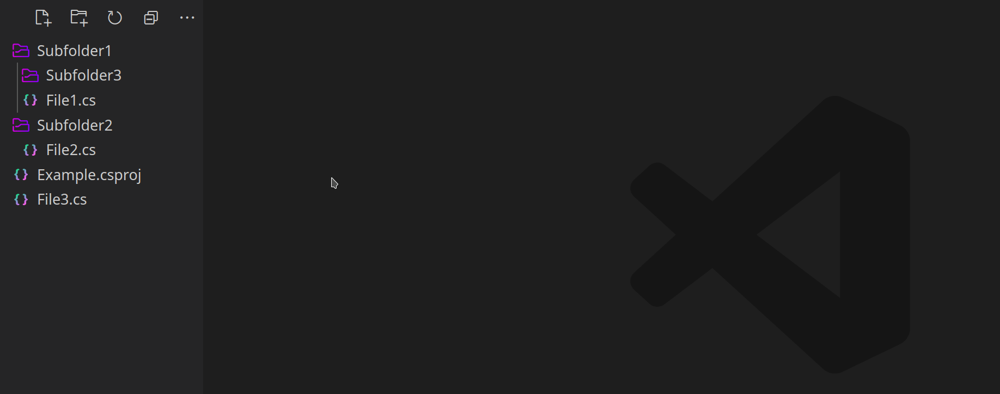
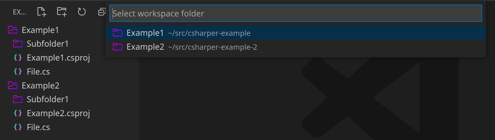
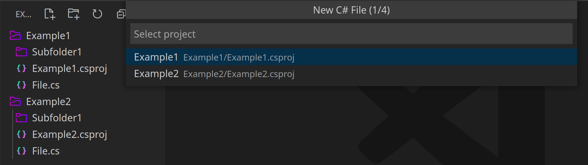
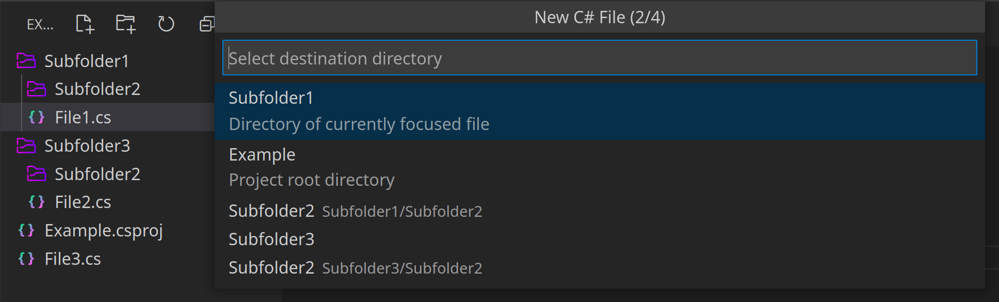

# Installation

You can install this extension from the [Visual Studio Marketplace](https://marketplace.visualstudio.com/items?itemName=tobiastengler.csharper).

# Functionality

This extension adds two new ways to create C# files.

## Create C# files from the Explorer Context Menu

Right clicking a directory now presents a new option: `New C# File`

After selecting a template and a filename the templated file will be created in the selected directory:

**Tip**: You can create new subdirectories by including a path seperator (`/`) in your chosen filename.

## Create C# files using a shortcut

If you prefer to only use your keyboard, there is also a new shortcut: `Ctrl+J Ctrl+J`

As any other keybinding in VS Code `Ctrl+J Ctrl+J` can be remapped to whatever you prefer. The name of the shortcut is `csharper.newFile`.

Since the shortcut can be pressed in different contexts, which workspace, project or directory to use, is not always apparent. Based on the context some or none of the following scenarios might apply:

### Multiple workspace folders

If you have opened a workspace with multiple folders, the shortcut will first prompt you to select one of those workspace folders:

### Multiple project files

If you are in a workspace folder with multiple project files, the shortcut will prompt you to select one of those projects:

If you press the shortcut while focusing a document, the nearest project file to that document will be selected per default.

### Destination directory

After the project directory has been determined you need to select the destination directory of your file:

All directories will be displayed in a flat hierarchy. If there are directories with the same name, the relative path to those directories will also be displayed.

# Available templates

You can check out all of the available templates [here](templates).

If you think that an important template is missing, feel free to create a PR that adds it! :)

# Current Limitations

- The `<RootNamespace>` tag in `.csproj` files is currently not taken into account
- Namespaces of files in the same directory are currenty not taken into account
